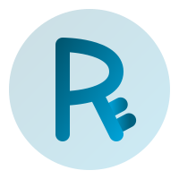

  
  <h1>Riddle Language</h1>

轻便，灵活，现代化的编程语言。

Riddle Language 是一个内存安全的编程语言，用于修复 C/C++ 的不足之处而出现。

如果你需要代码补全和语言支持，请看

- [VSCode 插件](https://github.com/wangziwenhk/riddle-lang-vscode)
- [Riddle 手册](https://wangziwenhk.github.io/riddle-docs/)

QQ群号：677741637

# 特性

- 内存安全：Riddle Language 在编译时保证内存安全，消除常见的编程错误，如空指针解引用和缓冲区溢出。这确保了软件的健壮性和安全性。
- 高性能：Riddle Language 将安全性与高性能执行相结合，使其适用于资源密集型应用。通过高级优化和精心设计的运行时系统实现这一目标。
- 简洁和表达力：Riddle Language 提供了简洁且富有表达力的语法，促进代码的可读性和可维护性。它提供了现代语言结构、强大的抽象和丰富的库集，以简化开发过程。
- 并发和并行：Riddle Language 内置对并发和并行编程的支持。它提供轻量级线程、异步编程模型和同步原语，简化了可扩展和高效应用程序的开发。
- 互操作性：Riddle Language 无缝集成现有的代码库和用其他语言编写的库。它提供了与 C 和 C++ 的简单绑定，并支持与流行框架和生态系统的互操作性。